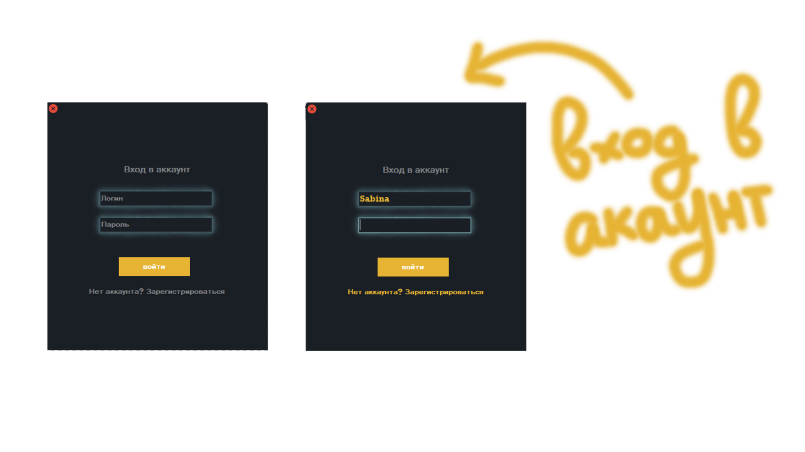
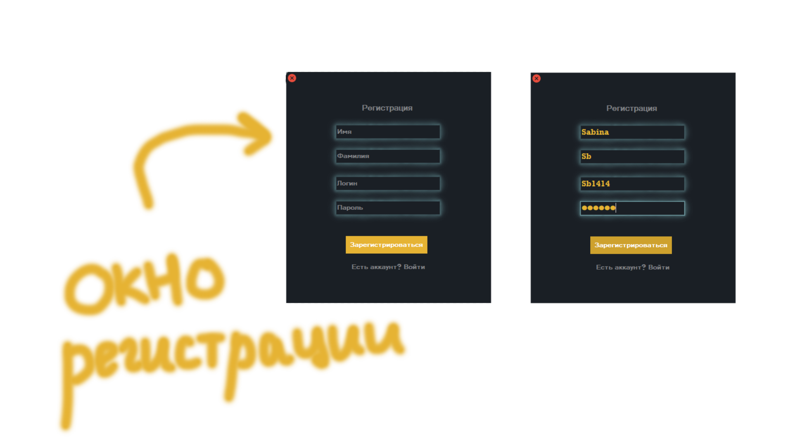
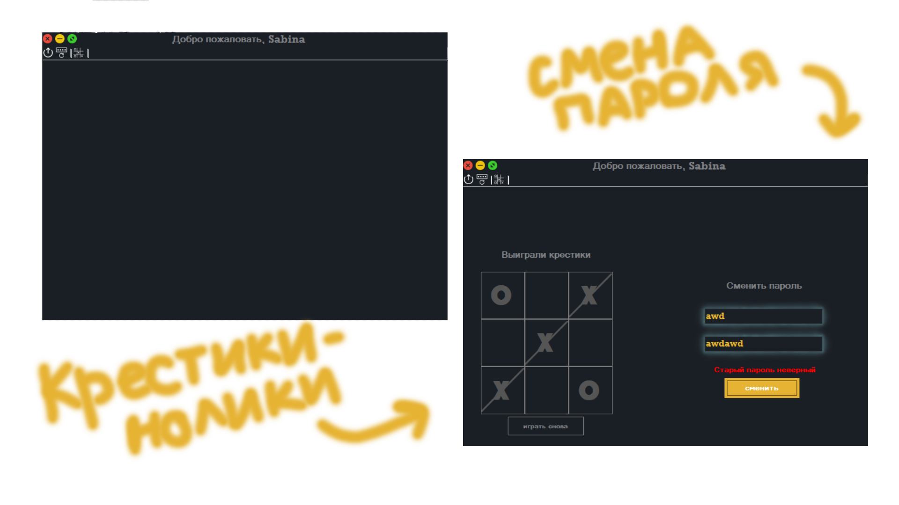

# Database-Application
> The application is written in C#, a framework is used.NET Windows Forms App

## Application with a local database
#### Initially, the login window opens with a login and password request. All checks are performed, if there is no account, then you can create it by clicking on the text under the login button. The registration window opens, everything is the same. Next, the main window opens, where you can open the tic-tac-toe game, change your password, delete your account, or go back to the login window, that is, log out of your account. On the main screen, the inscription "Welcome" appears on top + the login with which the user entered.

 
 
 

the application code is [in this folder](application/PassApp/bin/Debug)